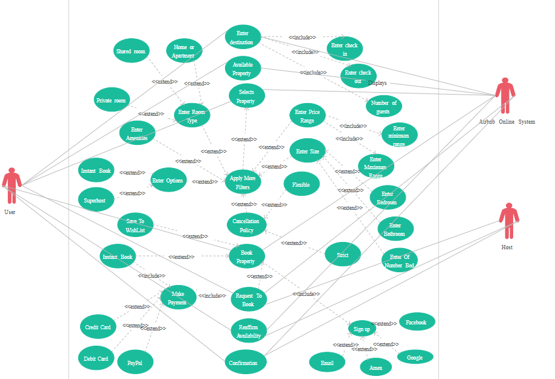

# Airbnb Clone Backend - Use Case Diagram

## Overview
This use case diagram illustrates the interactions between different actors (users) and the Airbnb Clone backend system. It visualizes the key functionalities and relationships between actors and use cases.

---

## Actors

### 1. Guest User
A user who searches for and books properties. Primary consumer of the platform.

### 2. Host User
A user who lists properties and manages bookings. Property owner or manager.

### 3. Administrator
System administrator who manages users, properties, and platform operations.

### 4. Payment Gateway
External system that processes payments (Stripe, PayPal).

### 5. Email Service
External system that sends email notifications.

---

## Use Cases by Actor

### Guest User Use Cases
1. **Register Account**
   - Create new user account
   - Verify email address
   - Set up profile

2. **Login/Logout**
   - Authenticate with credentials
   - Manage session
   - Logout securely

3. **Search Properties**
   - Search by location
   - Apply filters (price, amenities, dates)
   - View search results

4. **View Property Details**
   - View property information
   - See property images
   - Read reviews and ratings

5. **Make Booking**
   - Select dates
   - Check availability
   - Create booking request
   - Confirm booking

6. **Make Payment**
   - Enter payment details
   - Process payment
   - Receive confirmation

7. **Manage Bookings**
   - View booking history
   - Cancel bookings
   - Modify bookings

8. **Write Reviews**
   - Rate property (1-5 stars)
   - Write detailed review
   - Submit review

9. **Send Messages**
   - Contact host
   - Ask questions
   - Receive responses

10. **Manage Profile**
    - Update personal information
    - Upload profile picture
    - Manage preferences

---

### Host User Use Cases
1. **Register as Host**
   - Create host account
   - Complete host verification
   - Set up payout information

2. **Login/Logout**
   - Authenticate with credentials
   - Access host dashboard
   - Logout securely

3. **Create Property Listing**
   - Add property details
   - Upload property images
   - Set pricing and availability

4. **Manage Listings**
   - Edit property information
   - Update availability calendar
   - Delete listings

5. **Manage Bookings**
   - View booking requests
   - Accept/decline bookings
   - View booking calendar

6. **Manage Pricing**
   - Set base price
   - Create custom pricing for dates
   - Set discounts

7. **View Earnings**
   - Check payment history
   - View pending payouts
   - Generate financial reports

8. **Respond to Reviews**
   - Read guest reviews
   - Respond to feedback
   - Report inappropriate reviews

9. **Send Messages**
   - Communicate with guests
   - Answer inquiries
   - Send booking details

10. **Manage Profile**
    - Update host information
    - Manage verification status
    - Update payout methods

---

### Administrator Use Cases
1. **Login to Admin Panel**
   - Secure admin authentication
   - Access admin dashboard

2. **Manage Users**
   - View all users
   - Suspend/activate accounts
   - Delete users
   - Reset passwords

3. **Manage Properties**
   - Review property listings
   - Approve/reject listings
   - Remove inappropriate content
   - Monitor property status

4. **Manage Bookings**
   - View all bookings
   - Monitor booking activity
   - Handle disputes
   - Cancel problematic bookings

5. **Manage Payments**
   - Monitor transactions
   - Process refunds
   - Handle payment issues
   - View financial reports

6. **Moderate Reviews**
   - Review flagged reviews
   - Remove inappropriate reviews
   - Monitor review quality

7. **Generate Reports**
   - User analytics
   - Property statistics
   - Financial reports
   - System performance metrics

8. **Manage Platform Settings**
   - Update policies
   - Configure system settings
   - Manage notification templates

---

## Use Case Relationships

### Includes Relationships (Mandatory)
- **Make Booking** includes **Check Availability**
- **Make Booking** includes **Calculate Total Price**
- **Register Account** includes **Verify Email**
- **Make Payment** includes **Validate Payment Method**
- **Write Review** includes **Verify Completed Stay**

### Extends Relationships (Optional)
- **Search Properties** extends to **Save Search**
- **View Property Details** extends to **Add to Favorites**
- **Make Booking** extends to **Apply Discount Code**
- **Manage Profile** extends to **Enable Two-Factor Authentication**
- **Send Messages** extends to **Attach Files**

### Generalizations
- **Guest User** and **Host User** generalize to **Registered User**
- **Register Account** generalizes to **Register as Guest** and **Register as Host**
- **Manage Listings** generalizes to **Update Listing** and **Delete Listing**

---

## Key System Interactions

### Authentication Flow
```
User → Register/Login → System → Verify Credentials → Grant Access
```

### Booking Flow
```
Guest → Search Properties → View Details → Make Booking → 
System → Check Availability → Calculate Price → 
Guest → Make Payment → Payment Gateway → Process Payment → 
System → Confirm Booking → Email Service → Send Confirmation
```

### Property Listing Flow
```
Host → Create Listing → System → Validate Data → 
Admin → Review Listing → Approve → 
System → Publish Listing → Email Service → Notify Host
```

### Review Flow
```
Guest → Complete Stay → Write Review → System → Verify Stay → 
Publish Review → Notify Host → Host → Respond to Review
```

---

## Use Case Diagram Description

The use case diagram visualizes:

1. **Three primary actors**: Guest, Host, and Administrator
2. **Two external systems**: Payment Gateway and Email Service
3. **Core system boundary** containing all use cases
4. **Relationships** between actors and use cases
5. **System dependencies** with external services

### Diagram Layout
- **Left side**: Guest User use cases
- **Right side**: Host User use cases
- **Top**: Administrator use cases
- **Bottom**: External system interactions
- **Center**: Shared use cases (Login, Profile Management)

---

## Use Case Priorities

### Critical (Must Implement First)
- Register Account
- Login/Logout
- Search Properties
- View Property Details
- Create Property Listing
- Make Booking
- Make Payment

### High Priority (Phase 2)
- Manage Bookings
- Write Reviews
- Send Messages
- Manage Listings
- Manage Profile

### Medium Priority (Phase 3)
- Admin Management
- Advanced Search
- Earnings Dashboard
- Review Moderation

---

## Security Considerations

### Authentication Use Cases
- Implement JWT-based authentication
- Enforce strong password policies
- Support password reset functionality
- Enable two-factor authentication

### Authorization Use Cases
- Role-based access control (RBAC)
- Guests cannot access host features
- Hosts cannot access admin features
- Users can only manage their own data

### Data Protection
- Encrypt sensitive data
- Validate all inputs
- Sanitize user-generated content
- Implement rate limiting

---

## Integration Points

### Payment Gateway Integration
- Process payments securely
- Handle payment callbacks
- Manage refunds
- Store transaction records

### Email Service Integration
- Send verification emails
- Booking confirmations
- Payment receipts
- Notification emails

### External Services (Future)
- SMS notifications
- Cloud storage for images
- Map services for locations
- Calendar sync services


---


## Conclusion
This use case diagram serves as a blueprint for understanding all the interactions between users and the Airbnb Clone backend system. It helps developers, stakeholders, and designers visualize the system's functionality and plan the development roadmap effectively.